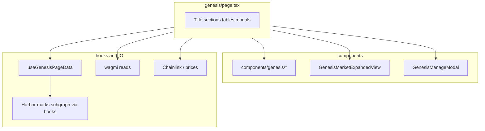
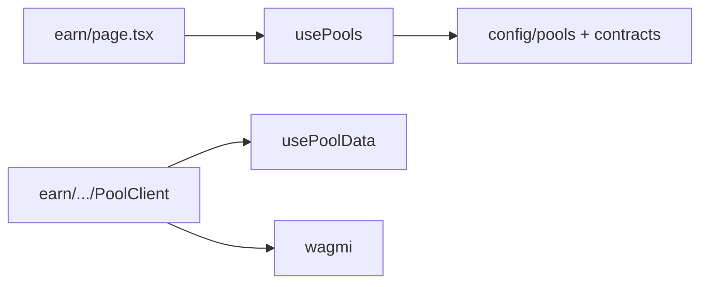
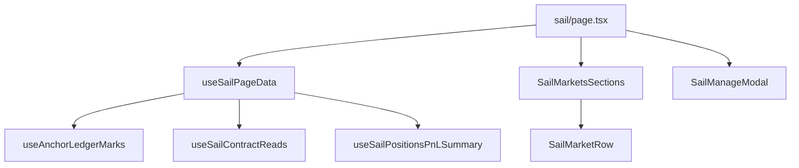

# Routes documentation and codebase audit: Genesis, Earn, Sail, Ledger Marks, Transparency

This document maps the five user-facing areas (routes, components, hooks, data sources), cross-cutting UI patterns, tooling findings, optimization priorities, and a **standalone security** section. Generated from repository analysis.

**Related internal docs:** [INDEX_PAGE_PATTERN.md](./INDEX_PAGE_PATTERN.md), [INDEX_PAGE_REFACTOR_PLAYBOOK.md](./INDEX_PAGE_REFACTOR_PLAYBOOK.md), [CLIENT_ERROR_VULNERABILITY_ASSESSMENT.md](./CLIENT_ERROR_VULNERABILITY_ASSESSMENT.md).

---

## 1. Genesis

### Purpose

Maiden voyage / genesis campaign markets: deposit, campaign stats, ledger marks, claims, and per-market expansion. Supports **UI+ / UI−** via `usePageLayoutPreference` (extended layout shows hero intro cards, campaign stats strip, etc.).

### Routes

| File | Role | Approx. lines |
|------|------|----------------|
| [`src/app/genesis/page.tsx`](../src/app/genesis/page.tsx) | Main genesis index: filters, tables, modals, wagmi reads | ~2944 |
| [`src/app/genesis/[id]/page.tsx`](../src/app/genesis/[id]/page.tsx) | Per-genesis-market detail: deposit/withdraw-style UI, charts, contract links | ~917 |

### Component tree (index)

- **Barrel** [`src/components/genesis/index.ts`](../src/components/genesis/index.ts): exports `GenesisPageTitleSection`, `GenesisPageHero`, `GenesisHeroIntroCards`, `GenesisCampaignStats`, `GenesisMarketsToolbar`, `GenesisMarketsSections`, `GenesisMarketTokenStrip`, `GenesisAprMarksColumn`, `GenesisMarketRowClaimActions`.
- **Index page imports** (subset): `GenesisAprMarksColumn`, `GenesisCampaignStats`, `GenesisHeroIntroCards`, `GenesisMarketsSections`, `GenesisMarketRowClaimActions`, `GenesisMarketTokenStrip`, `GenesisPageTitleSection`. `GenesisMarketsToolbar` is **not** imported by `page.tsx` directly but is used inside [`GenesisMarketsSections`](../src/components/genesis/GenesisMarketsSections.tsx). [`GenesisPageHero`](../src/components/genesis/GenesisPageHero.tsx) is exported from the barrel but **has no importers** outside its own file (candidate dead export; see [INDEX_PAGE_PATTERN.md](./INDEX_PAGE_PATTERN.md) for intended reuse).
- **Outside `components/genesis/`:** [`GenesisMarketExpandedView`](../src/components/GenesisMarketExpandedView.tsx), [`GenesisManageModal`](../src/components/GenesisManageModal.tsx).

### Hooks and data sources (index)

| Hook / source | Role |
|---------------|------|
| [`useGenesisPageData`](../src/hooks/useGenesisPageData.ts) | Genesis market list, chain options, subgraph marks via `useAllHarborMarks` / `useAllMarketBonusStatus`, errors |
| [`useSortedGenesisMarkets`](../src/hooks/useSortedGenesisMarkets.ts) | Ordering for display |
| [`useGenesisClaimMarket`](../src/hooks/useGenesisClaimMarket.ts) | Claim flow for a market |
| [`useTotalGenesisTVL`](../src/hooks/useTotalGenesisTVL.ts), [`useTotalMaidenVoyageMarks`](../src/hooks/useTotalMaidenVoyageMarks.ts) | Aggregates |
| [`useWstETHAPR`](../src/hooks/useWstETHAPR.ts), [`useFxSAVEAPR`](../src/hooks/useFxSAVEAPR.ts) | APR helpers |
| [`useCoinGeckoPrices`](../src/hooks/useCoinGeckoPrice.ts), [`useMultipleTokenPrices`](../src/hooks/useTokenPrices.ts), [`useMultipleCollateralPrices`](../src/hooks/useCollateralPrice.ts) | Pricing |
| [`computeGenesisRowUsdPricing`](../src/utils/genesisRowPricing.ts), [`formatGenesisMarketDisplayName`](../src/utils/genesisDisplay.ts) | Display math |
| **Wagmi** | `useAccount`, `useContractReads`, `useContractRead` |
| **Config** | [`markets`](../src/config/markets.ts), Chainlink feeds, ABIs from `@/abis/shared` |

### Detail route (`genesis/[id]`)

- **Wagmi:** `useAccount`, `useContractReads`, `useWriteContract`, `usePublicClient`.
- **UI:** [`HistoricalDataChart`](../src/components/HistoricalDataChart.tsx), [`EtherscanLink`](../src/components/shared), [`InfoTooltip`](../src/components/InfoTooltip.tsx), inline helpers (`ContractInfoSection`, `InputField`, etc.) defined **in-file**.

### Diagram



---

## 2. Earn

### Purpose

Directory of stability pools and deep link to a single pool’s **Earn** UI (deposit, rewards, charts).

### Routes

| File | Role | Approx. lines |
|------|------|----------------|
| [`src/app/earn/page.tsx`](../src/app/earn/page.tsx) | Lists pools from config via `usePools()`, grouped by `groupName` | ~87 |
| [`src/app/earn/[marketId]/[poolType]/page.tsx`](../src/app/earn/[marketId]/[poolType]/page.tsx) | Server wrapper: `generateStaticParams` from markets, renders `PoolClient` | small |
| [`src/app/earn/[marketId]/[poolType]/PoolClient.tsx`](../src/app/earn/[marketId]/[poolType]/PoolClient.tsx) | Client: pool stats, deposit/withdraw actions, charts, contract links | ~777 |

### Components

- **No** `components/earn/` directory. Shared: [`HistoricalDataChart`](../src/components/HistoricalDataChart.tsx), [`TokenIcon`](../src/components/TokenIcon.tsx), [`EtherscanLink`](../src/components/shared), [`InfoTooltip`](../src/components/InfoTooltip.tsx).

### Hooks

| Hook | Role |
|------|------|
| [`usePools`](../src/hooks/usePools.ts) | Reads [`pools`](../src/config/pools.ts) / `markets` from [`config/contracts`](../src/config/contracts.ts) |
| [`usePoolData`](../src/hooks/usePoolData.ts) | Per-pool dynamic data |
| **Wagmi** | Reads/writes inside `PoolClient` |

### Diagram



---

## 3. Sail

### Purpose

Sail (leveraged) markets index: filters, PnL stats, ledger marks bar, expandable rows, manage modal.

### Route

| File | Approx. lines |
|------|----------------|
| [`src/app/sail/page.tsx`](../src/app/sail/page.tsx) | ~262 — orchestrator; **UI+** shows `SailExtendedHero`, stats, marks bar, `SailMarketsSections` |

### Components ([`src/components/sail/`](../src/components/sail/))

| Area | Files |
|------|--------|
| Layout / hero | `SailPageTitleSection`, `SailExtendedHero`, `SailHeroIntroCards` |
| Stats / marks | `SailUserStatsCards`, `SailLedgerMarksBar`, `SailMarksSubgraphErrorBanner` |
| Table | `SailMarketsToolbar`, `SailMarketsTableHeader`, `SailMarketsSections`, `SailMarketRow`, `SailMarketExpandedView` |
| Fees | `SailFeeBandsPanel`, `SailFeeBandBadge`, `SailMintRedeemFeeColumn`, `SailFeeRatioCell` |
| Barrel | [`src/components/sail/index.ts`](../src/components/sail/index.ts) |

**Modal:** [`SailManageModal`](../src/components/SailManageModal.tsx).

### Hooks

| Hook | Role |
|------|------|
| [`useSailPageData`](../src/hooks/useSailPageData.ts) | Central aggregator: filters, `useAnchorLedgerMarks`, `useMarketBoostWindows`, `useSailContractReads`, PnL hooks, `activeMarkets`, price graph URL via [`getSailPriceGraphUrlOptional`](../src/config/graph.ts) |
| **Related** | `useSailPositionsPnLSummary`, `useSailContractReads` (pulled in by page data) |

**Manage actions:** [`SailMarketRow`](../src/components/sail/SailMarketRow.tsx) uses [`INDEX_MANAGE_BUTTON_CLASS_DESKTOP`](../src/utils/indexPageManageButton.ts).

### Diagram



---

## 4. Ledger Marks

### Purpose

Leaderboards and user-facing Harbor / Anchor / Sail marks: **GraphQL** to marks subgraph, campaign tabs, sorting, and alignment with [`useAnchorLedgerMarks`](../src/hooks/useAnchorLedgerMarks.ts).

### Route

| File | Approx. lines |
|------|----------------|
| [`src/app/ledger-marks/page.tsx`](../src/app/ledger-marks/page.tsx) | **~1680** — monolithic: query strings, `fetch(graphUrl)`, React Query, UI |

### Structure (logical)

1. **GraphQL documents** (top of file): `ALL_DEPOSITS_QUERY`, `USER_MARKS_QUERY`, `CAMPAIGN_USER_MARKS_QUERY`, `CAMPAIGN_LEADERBOARD_QUERY`, `ALL_HA_TOKEN_BALANCES_QUERY`, etc.
2. **Helpers:** `formatAddress`, `isContractAddress`, `getContractType`, indexer error helpers.
3. **Default export:** `LedgerMarksLeaderboard` — state for tabs (`campaigns` | `anchor-sail`), campaign id, sorts, chain time sync, `useAnchorLedgerMarks`, campaign/leaderboard queries via `fetch` + [`getGraphUrl`](../src/config/graph.ts) / [`getGraphHeaders`](../src/config/graph.ts).

### Shared UI

[`IndexPageTitleSection`](../src/components/shared/IndexPageTitleSection.tsx), [`INDEX_MARKETS_TOOLBAR_ROW_CLASS`](../src/components/shared/indexMarketsToolbarStyles.ts), [`FilterSingleSelectDropdown`](../src/components/FilterSingleSelectDropdown.tsx).

---

## 5. Transparency

### Purpose

Read-heavy dashboard: per-market and per-pool transparency (collateral ratio, incentives, oracle bands, user pool positions), charts, maintenance badges.

### Route

| File | Approx. lines |
|------|----------------|
| [`src/app/transparency/page.tsx`](../src/app/transparency/page.tsx) | **~1723** — monolithic |

### Data

| Source | Role |
|--------|------|
| [`useTransparencyData`](../src/hooks/useTransparencyData.ts) | `useContractReads`-style batching: minter, stability pools, manager, oracle — exposes `markets`, `pools`, `userPools`, `refetch` |
| [`useAllStabilityPoolRewards`](../src/hooks/useAllStabilityPoolRewards.ts) | Reward token metadata for pools |
| **Charts** | `recharts` (`PieChart`, `Pie`, `Cell`, `ResponsiveContainer`, `Tooltip`, `Legend`) |

### In-file helpers (duplication risk)

`bandsFromConfig`, `FeeBandBadge`, `FeeTransparencyBands`, `CopyButton`, `ContractAddressItem`, `HealthBadge`, `FeeBadge`, `WithdrawalStatusBadge`, `DataRow`, `MarketCard`, … Several are **unused** per ESLint (see below) — overlap conceptually with Sail fee components (`SailFeeBandBadge`, etc.).

### Style note

[`import Image from "next/image"`](../src/app/transparency/page.tsx) appears **after** top-level constants (unusual ordering); harmless but hurts readability.

---

## 6. Cross-cutting UI: buttons, toolbars, layout

### Centralized tokens (use these first)

| Artifact | Path | Contents |
|----------|------|----------|
| Index row buttons | [`src/utils/indexPageManageButton.ts`](../src/utils/indexPageManageButton.ts) | `INDEX_MANAGE_BUTTON_CLASS_DESKTOP` (navy), `INDEX_WITHDRAW_BUTTON_CLASS_DESKTOP_CORAL`, `INDEX_MODAL_CANCEL_BUTTON_CLASS_DESKTOP`, `INDEX_MANAGE_BUTTON_CLASS_COMPACT` |
| Toolbar + coral tags | [`src/components/shared/indexMarketsToolbarStyles.ts`](../src/components/shared/indexMarketsToolbarStyles.ts) | `INDEX_MARKETS_TOOLBAR_ROW_CLASS`, `INDEX_CORAL_INFO_TAG_CLASS`, `INDEX_CORAL_LEDGER_TAG_PILL_CLASS` |
| Page title | [`src/components/shared/IndexPageTitleSection.tsx`](../src/components/shared/IndexPageTitleSection.tsx) | Shared title block |
| UI+ / UI− | [`PageLayoutToggle`](../src/components/PageLayoutToggle.tsx), [`pageLayoutToggleRoutes`](../src/config/pageLayoutToggleRoutes.ts) | Persisted layout preference |

### Usage in Genesis / Sail

- [`GenesisMarketRowClaimActions`](../src/components/genesis/GenesisMarketRowClaimActions.tsx) imports **manage** classes from `indexPageManageButton`.
- [`SailMarketRow`](../src/components/sail/SailMarketRow.tsx) uses `INDEX_MANAGE_BUTTON_CLASS_DESKTOP`.

### Grep snapshot (raw Tailwind / hex in route folders)

Approximate **matches per area** for `#1E4775`, `#FF8A7A`, or `INDEX_MANAGE_BUTTON` / `indexPageManageButton` in `src/app/<area>`:

| Area | Approx. matches |
|------|-----------------|
| genesis | ~106 |
| earn | 0 (uses other palette, e.g. `#17395F`) |
| sail | ~1 (page-level; more in `components/sail`) |
| ledger-marks | ~48 |
| transparency | ~105 |

**Earn** does not use the navy hex pattern in `app/earn`; pool UI uses [`bg-[#17395F]`](../src/app/earn/page.tsx) and similar.

### Generalization recommendations

1. **Replace one-off coral buttons** (e.g. Sail error state “Try again” in [`sail/page.tsx`](../src/app/sail/page.tsx) uses inline `bg-[#FF8A7A]`) with `INDEX_WITHDRAW_BUTTON_CLASS_DESKTOP_CORAL` or a small `Button` variant component.
2. **Hero intro grids** — Genesis, Sail, and Anchor each implement a similar “card grid” with `bg-black/[0.10]` tiles; consider a shared `HeroIntroCard` + map config (title, icon, body).
3. **Fee bands** — Transparency in-file `bandsFromConfig` / `FeeBandBadge` vs Sail’s `SailFeeBandBadge` / `SailFeeBandsPanel`: extract shared types + display in `utils/` or `components/fees/`.
4. **Continue migrating** index actions to [`indexPageManageButton.ts`](../src/utils/indexPageManageButton.ts) per [INDEX_PAGE_PATTERN.md](./INDEX_PAGE_PATTERN.md).

---

## 7. Dead / redundant code — ESLint summary

**Tooling:** `knip` / `ts-prune` are **not** in [`package.json`](../package.json). Recommended follow-up: add `knip` or run `npx knip` periodically for unused exports.

**ESLint** (scoped to the five route trees):

```bash
yarn eslint "src/app/genesis/**/*.{tsx,ts}" "src/app/earn/**/*.{tsx,ts}" \
  "src/app/sail/**/*.{tsx,ts}" "src/app/ledger-marks/**/*.{tsx,ts}" \
  "src/app/transparency/**/*.{tsx,ts}"
```

**Result (snapshot):** **110 problems** (**49 errors**, **61 warnings**).

### Representative findings

| Category | Examples |
|----------|----------|
| **Unused imports / vars** | [`transparency/page.tsx`](../src/app/transparency/page.tsx): `formatTokenPrice`, `formatTokenBalance`, `calculatePeggedPriceUSD` imported unused; `CopyButton`, `FeeBadge`, `DataRow` defined but unused; unused `maxPrice`, `distanceToThreshold`, `anchorSupplyNum` |
| **`no-explicit-any`** | Heavy in `ledger-marks/page.tsx`, `transparency/page.tsx`, and related helpers |
| **React hooks deps** | e.g. `useMemo` missing `getLiveMarks` dependency (ledger-marks area per ESLint) |
| **Unused assignments** | e.g. `activeAnchorBoostEndTimestamp`, `activeSailBoostEndTimestamp` in a ledger-marks query block |

### Structural redundancy

| Item | Note |
|------|------|
| **`GenesisPageHero`** | Exported from [`components/genesis/index.ts`](../src/components/genesis/index.ts) but **unused** anywhere in `src/` (only self-reference). Consider removing export or wiring into a route. [`GenesisMarketsToolbar`](../src/components/genesis/GenesisMarketsToolbar.tsx) is used by [`GenesisMarketsSections`](../src/components/genesis/GenesisMarketsSections.tsx). |
| **Mega-files** | `genesis/page.tsx`, `ledger-marks/page.tsx`, `transparency/page.tsx` — split into `components/genesis/*` sections (partially done), `components/ledger-marks/*`, `components/transparency/*` mirroring Sail. |

---

## 8. Optimizations (prioritized)

1. **Split monolithic pages** — Extract presentational sections + hooks from `ledger-marks/page.tsx` and `transparency/page.tsx`; reduces merge conflicts and improves memo boundaries.
2. **Fix ESLint errors** — `no-explicit-any` and unused symbols; reduces noise and catches real bugs.
3. **Virtualize long tables** — If leaderboard or market lists grow, consider windowing (`@tanstack/react-virtual` or similar).
4. **Chart re-renders** — Transparency `recharts` trees: ensure stable `data` references from `useTransparencyData` / memoized selectors.
5. **Remove client `console.log` in hot paths** — See [Security](#9-security-frontend-review-separate-topic) (`getGraphHeaders`).

---

## 9. Security (frontend review — separate topic)

This section is **not** a full penetration test; it documents trust boundaries and issues visible from static review.

### 9.1 Subgraph / GraphQL

- **Endpoint:** [`getGraphUrl`](../src/config/graph.ts), [`GRAPH_CONFIG`](../src/config/graph.ts) — defaults to The Graph Studio URL; overridable via `NEXT_PUBLIC_GRAPH_URL` and testnet flags.
- **API key:** `getGraphHeaders` uses `process.env.NEXT_PUBLIC_GRAPH_API_KEY || GRAPH_API_KEY` where **`GRAPH_API_KEY` is a hardcoded fallback string** in source. Because this module is imported by **client** bundles, **any fallback is shipped to the browser** — treat as **public**, rotate keys if they were meant to be secret, and prefer env-only keys for sensitive gateways.
- **Trust model:** Leaderboard and marks data are **indexed off-chain**; users should not treat them as authoritative for financial decisions without verifying on-chain state.
- **Query construction:** GraphQL strings are static in app code; no user-controlled query concatenation observed in these routes.

### 9.2 Environment variables

- **`NEXT_PUBLIC_*`** — Visible in the browser. No private keys should use this prefix (see project security docs).

### 9.3 On-chain actions

- **Wagmi** writes (Earn `PoolClient`, modals) require wallet approval; contract addresses should come from **config** (`markets`, ABIs) — continue auditing new markets in config only.

### 9.4 Data exposure

- **Leaderboards / transparency** show **wallet addresses** and positions — **public-by-design** for DeFi dashboards; document for users if needed.

### 9.5 XSS / HTML injection

- Grep across `src` for `dangerouslySetInnerHTML` / `innerHTML`: **no matches** at audit time. Re-check if rich HTML is added later.

### 9.6 Logging

- [`getGraphHeaders`](../src/config/graph.ts) logs GraphQL URL (redacted) and API key presence on **every client call** when `window` is defined — noisy and may leak operational info in production consoles; consider gating to development only.

### 9.7 Dependencies

- Keep `wagmi`, `viem`, `@tanstack/react-query`, `recharts` patched per org process; see [CLIENT_ERROR_VULNERABILITY_ASSESSMENT.md](./CLIENT_ERROR_VULNERABILITY_ASSESSMENT.md) if applicable.

### 9.8 Follow-ups (out of scope here)

- Full dependency audit / SAST pipeline.
- Formal threat model for subgraph compromise (fake leaderboard) vs on-chain verification UX.

---

## Appendix A: File size reference

| Path | Lines (approx.) |
|------|-----------------|
| `src/app/genesis/page.tsx` | 2944 |
| `src/app/genesis/[id]/page.tsx` | 917 |
| `src/app/earn/page.tsx` | 87 |
| `src/app/earn/.../PoolClient.tsx` | 777 |
| `src/app/sail/page.tsx` | 262 |
| `src/app/ledger-marks/page.tsx` | 1675 |
| `src/app/transparency/page.tsx` | 1723 |

---

## Appendix B: Existing docs cross-reference

| Doc | Relevance |
|-----|-----------|
| [INDEX_PAGE_PATTERN.md](./INDEX_PAGE_PATTERN.md) | Shared index UX |
| [INDEX_PAGE_REFACTOR_PLAYBOOK.md](./INDEX_PAGE_REFACTOR_PLAYBOOK.md) | Refactor patterns |
| [CLIENT_ERROR_VULNERABILITY_ASSESSMENT.md](./CLIENT_ERROR_VULNERABILITY_ASSESSMENT.md) | Client error handling |
| [ALCHEMY_KEY_ROTATION_AND_SECURITY.md](./ALCHEMY_KEY_ROTATION_AND_SECURITY.md) | RPC keys |
